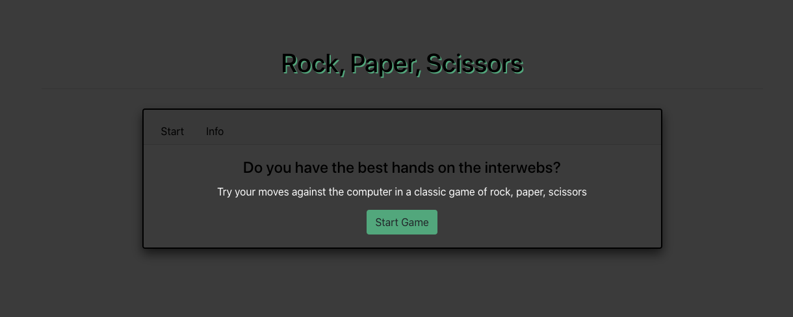
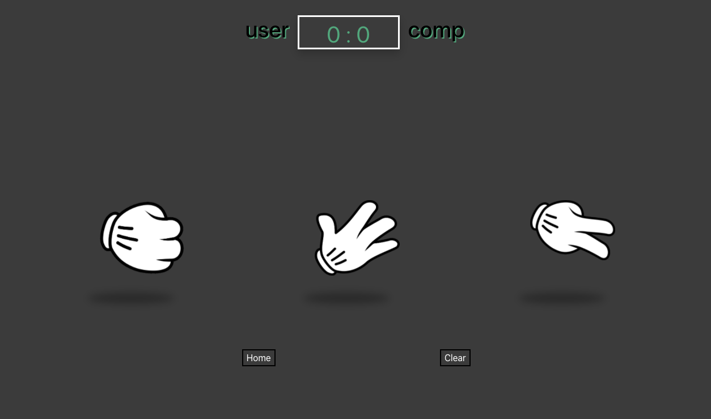
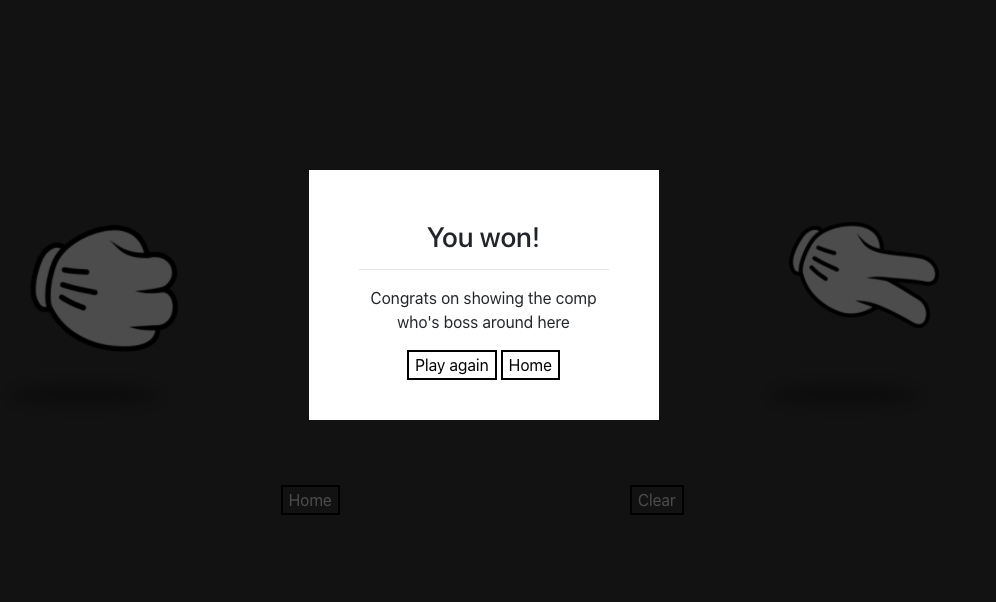

# Rock, Paper, Scissors

## Description
A fun project to build out a RPS game with a Reactjs framework. Included some new features such as a modal fitted through a portal

## Table of Contents
* [Description](#Description)
* [Installation](#Installation)
* [Usage](#Usage)
* [License](#License)
* [Contributing](#Contributing)
* [Test](#Tests)
* [Questions](#Questions)

## Installation
Click [here](https://rps-game-bon.herokuapp.com/) to open the app on Heroku

## Screenshots

## ILicense
MIT

## Contributing
A user scoreboard would be an interesting addition to the game

## Questions
- [GitHub](https://github.com/CodyBonsma)
- [Email](codybonsma@gmail.com)
